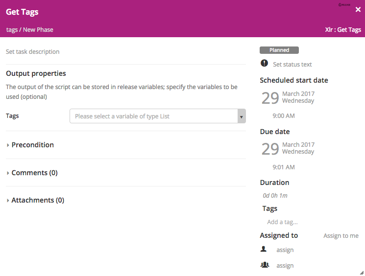
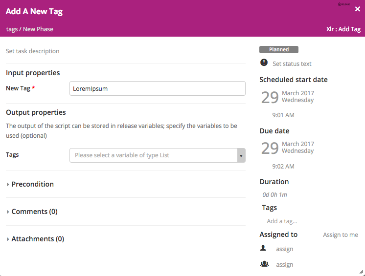
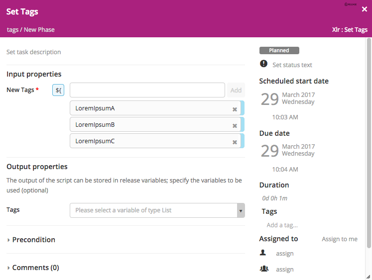
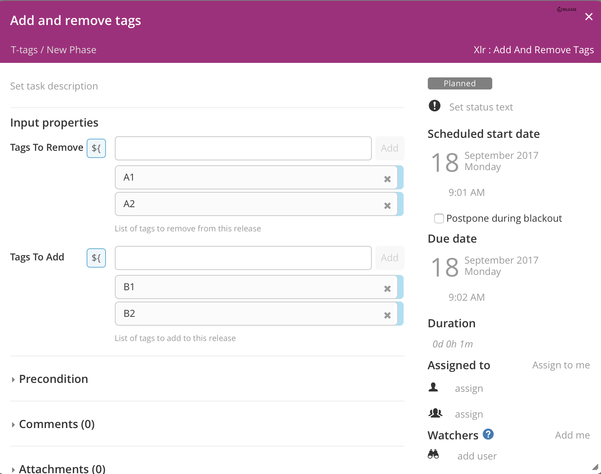
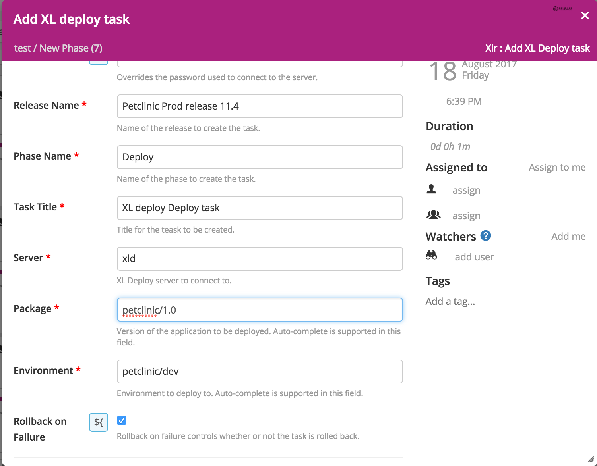

# Preface #

This document describes the functionality provided by the xlr-xlrelease-plugin.

See the **[XL Release Documentation](https://docs.xebialabs.com/xl-release/index.html)** for background information on XL Release and release concepts.

# CI status #

[![Build Status][xlr-xlrelease-travis-image] ][xlr-xlrelease-travis-url]
[![Codacy Status][xlr-xlrelease-codacy-image] ][xlr-xlrelease-codacy-url]
[![Code Climate Status][xlr-xlrelease-code-climate-image] ][xlr-xlrelease-code-climate-url]
[![License: MIT][xlr-xlrelease-plugin-license-image] ][xlr-xlrelease-plugin-license-url]

[xlr-xlrelease-travis-image]: https://travis-ci.org/xebialabs-community/xlr-xlrelease-plugin.svg?branch=master
[xlr-xlrelease-travis-url]: https://travis-ci.org/xebialabs-community/xlr-xlrelease-plugin
[xlr-xlrelease-codacy-image]: https://api.codacy.com/project/badge/Grade/84c1d8ffa58648daa7e165462cdcce22
[xlr-xlrelease-codacy-url]: https://www.codacy.com/app/rvanstone/xlr-xlrelease-plugin
[xlr-xlrelease-code-climate-image]: https://codeclimate.com/github/xebialabs-community/xlr-xlrelease-plugin/badges/gpa.svg
[xlr-xlrelease-code-climate-url]: https://codeclimate.com/github/xebialabs-community/xlr-xlrelease-plugin
[xlr-xlrelease-plugin-license-image]: https://img.shields.io/badge/License-MIT-yellow.svg
[xlr-xlrelease-plugin-license-url]: https://opensource.org/licenses/MIT

# Overview #

The xlr-xlrelease-plugin is an XL Release plugin that allows you to:

  * Programmatically create a template and assign tags to it
  * Create and start another release from an existing release. So you can create a subrelease from a parent release
  * Programmatically delete phases in the current release

For XL Release version 4.8.x you'll need at least version 1.7.x of the plugin.

## Tasks ##
+ Create and Start SubRelease
  * `templateName`: Name of the template from which to create the subrelease (`string`) 
  * `releaseTitle`: Name of the subrelease (`string`)
  * `releaseDescription`: Description of the subrelease (`string`)
  * `variables`: Comma-separated key-value pairs for the values of variables required by the subrelease, e.g. var1=value1,var2=value2 (`string`)
  * `asynch`: If [false], the task will wait for the subrelease to finish
  * `gateTaskTitle`: Title of the gate task in this release that should wait for the subrelease to complete. Skipped if not specified (blank).

+ Create Template
  * `templateName`: Name of the template to create (`string`)
  * `tags`: Comma-separated list of tags to associate with this template e.g. tag1,tag2 (`string`)

+ Delete Phases
  * `phases (deprecated)`: Comma-separated list of names of phases in the current release to delete e.g. phase1,phase2 (`string`)
  * `phases`: `set_of_string`, defining all phases to be deleted.
  * **This task requires XL Release 4.5.0 or higher**

+ Get Task ID
  *  `taskTitle`: Title of the task to get the id for (`string`)
  * **This task requires XL Release 4.5.0 or higher**

+ Get Tags
  * `tags`: A List of the current tags for the release

  
  
+ Add Tag
  * `newTag`: New tag to add to the list of tags for the release
  * `tags`: A List of the current tags for the release

  
  
+ Set Tags
  * `newTags`: A List of tags to replace the tag list with
  * `tags`: A list of the current tags for the release

  
  
+ Add And Remove Tags
  * `tagsToRemove`: A list of tags to remove from the release
  * `tagsToAdd`: A list of tags to add to the release

  

+ Add XL Deploy task
  * `releaseName`: Name of the release where XL deploy task needs to be added
  * `phaseName`: Name of the phase, task will be added at the bottom of the phase
  * `taskTitle`: Title of the task to be created
  * `xldServer`: XL deploy server to be used
  * `deploymentPackage`: Version of the application to be deployed.
  * `deploymentEnvironment`: Environment to deploy to.
  * `rollbackOnFailure`: Rollback on failure controls whether or not the task is rolled back.

  
  
